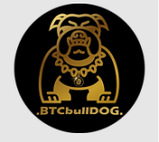
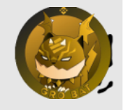

# ABDULMUMIN, Alhassan Alhaji

## (FULLSTACK WEB && BLOCKCHAIN DEVELOPER) || WEB3 DEVELOPER

## ABOUT

### Hi there 👋

I am a positive and competent Freelancer who specializes in Blockchain and Web Development.

In my years of experience in Web development and Blockchain technology, I have contributed to dozens of projects and  I've honed my skills in the following programming languages, technologies and tools:

- Programming languages

  - JavaScript
  - Typescript
  - PHP
  - Solidity
  - Python

- databases

  - MySQL
  - MongoDB
  - Firestore

- Technologies

  - Blockchain
  - Node.js - Express - REST API
  - React.js - Next.js
  - Sass/scss

- Tools

  - Git and GitHub
  - Firebase
  - Adobe Photoshop
  - CorelDRAW

- Frameworks

  - Tailwind CSS
  - Chakra-UI
  - Jquery
  - Bootstrap
  - Material-UI
  - ... and a few others.

- Regular communication is really important to me, so let’s keep in touch! @ alhaji4megahit@gmail.com

 

 

  

## RECENT PROJECTS

<table>
  <tr>
    <td rowspan="4">
      
    </td>
    <td><a href="https://www.nftprintpro.com/">nftprintpro.com </a>&#129109;</td>
  </tr>
  <tr>
    <td>
    Frontend: REACT JS, CHAKRA UI,  WEB3... 
    Backend: NODE JS, EXPRESS, MONGO DB, SENDGRID...
    </td>
  </tr>
  <tr>
    <td>A Website that tracks and prints Multichain collectibles(Solana and Ethereum) in user's wallet, It also allows them to mint and print their own arts</td>
  </tr>
  <tr>
    <td>
      In a team
    </td>
  </tr>
</table>

<table>
  <tr>
    <td rowspan="4">
      
    </td>
    <td><a href="https://btcbulldog.finance/">btcbulldog.finance </a>&#129109;</td>
  </tr>
  <tr>
    <td>NEXT JS, REACT JS, REACT CHARTS, WEB3 JS....</td>
  </tr>
  <tr>
    <td>A dashboard that displays the market and account data for a reflection token, also has a chart, Mint page, Buying feature and a transaction History</td>
  </tr>
  <tr>
    <td>
      Solo
    </td>
  </tr>
</table>

<table>
  <tr>
    <td rowspan="4">
      
    </td>
    <td><a href="https://www.legitcryptoloungenfts.com/">legitcryptoloungenfts.com </a>&#129109;</td>
  </tr>
  <tr>
    <td>NEXT JS, TYPESCRIPT, REACT JS, SASS, WEB3 JS....</td>
  </tr>
  <tr>
    <td>A Minting dashboard that allows users to mint NFTs with BUSD and display other contract details, It also has a reward distribution section</td>
  </tr>
  <tr>
    <td>
      Solo
    </td>
  </tr>
</table>

<table>
  <tr>
    <td rowspan="4">
      
    </td>
    <td><a href="https://www.grobattoken.com/">grobattoken.com </a>&#129109;</td>
  </tr>
  <tr>
    <td>NEXT JS, REACT JS, TYPESCRIPT, WEB3 JS....</td>
  </tr>
  <tr>
    <td>A Crypto Project's website with a Reflection token DApp, NFT mint page, previews, Market data, Account Data, A buy feature and others</td>
  </tr>
  <tr>
    <td>
      In a team, Worked on the dashboard, NFT page and little changes on the Homepage
    </td>
  </tr>
</table>

<table>
  <tr>
    <td rowspan="4">
      
    </td>
    <td><a href="https://biggestbuy.tech/">biggestbuy.tech </a>&#129109;</td>
  </tr>
  <tr>
    <td>HTML, CSS, JS, WEB3 JS....</td>
  </tr>
  <tr>
    <td>A Crypto Project's website with a Data Dapp that displays the active telegram channels in a contest for users with bbb in their wallets and A staking DApp</td>
  </tr>
  <tr>
    <td>
      In a team, Worked on both DApps
    </td>
  </tr>
</table>

<table>
  <tr>
    <td rowspan="4">
      
    </td>
    <td><a href="https://babyloninu.web.app/">babyloninu.web.app </a>&#129109;</td>
  </tr>
  <tr>
    <td>HTML, CSS, JS, JQUERY, SOLIDITY, WEB3 JS...</td>
  </tr>
  <tr>
    <td>A Staking Dapp with three staking pools on the Ethereum Network, Each pool with their own reward systems, APY and staking mechanism</td>
  </tr>
  <tr>
    <td>
      Solo
    </td>
  </tr>
</table>

<table>
  <tr>
    <td rowspan="4">
      
    </td>
    <td><a href="https://shepherdinu.tech/">shepherdinu.tech </a>&#129109;</td>
  </tr>
  <tr>
    <td>HTML, CSS, JS, JQUERY , WEB3 JS...</td>
  </tr>
  <tr>
    <td>A Crypto Project's website with a Generic Staking DApp on binance smart chain with a fixed APY and days</td>
  </tr>
  <tr>
    <td>
      In a team, Worked on the DApp
    </td>
  </tr>
</table>

<table>
  <tr>
    <td rowspan="4">
      
    </td>
    <td><a href="https://voltinu.in/">Voltinu.in </a>&#129109;</td>
  </tr>
  <tr>
    <td>HTML, CSS, JS, JQUERY, WEB3 JS...</td>
  </tr>
  <tr>
    <td>A Crypto Project's website with a DApp dasboard that displays the current market data for the project and connected user data</td>
  </tr>
  <tr>
    <td>
      Solo
    </td>
  </tr>
</table>

<table>
  <tr>
    <td rowspan="4">
      
    </td>
    <td><a href="https://deridexprotocol.com/">deridexprotocol.com </a>&#129109;</td>
  </tr>
  <tr>
    <td>HTML, CSS, JS, JQUERY...</td>
  </tr>
  <tr>
    <td>A Crypto Project's website</td>
  </tr>
  <tr>
    <td>
      In a team
    </td>
  </tr>
</table>

<!--
**An0nym0usAng3l/An0nym0usAng3l** is a ✨ _special_ ✨ repository because its `README.md` (this file) appears on your GitHub profile.

Here are some ideas to get you started:

- 🔭 I’m currently working on ...
- 🌱 I’m currently learning ...
- 👯 I’m looking to collaborate on ...
- 🤔 I’m looking for help with ...
- 💬 Ask me about ...
- 📫 How to reach me: ...
- 😄 Pronouns: ...
- ⚡ Fun fact: ...
-->
